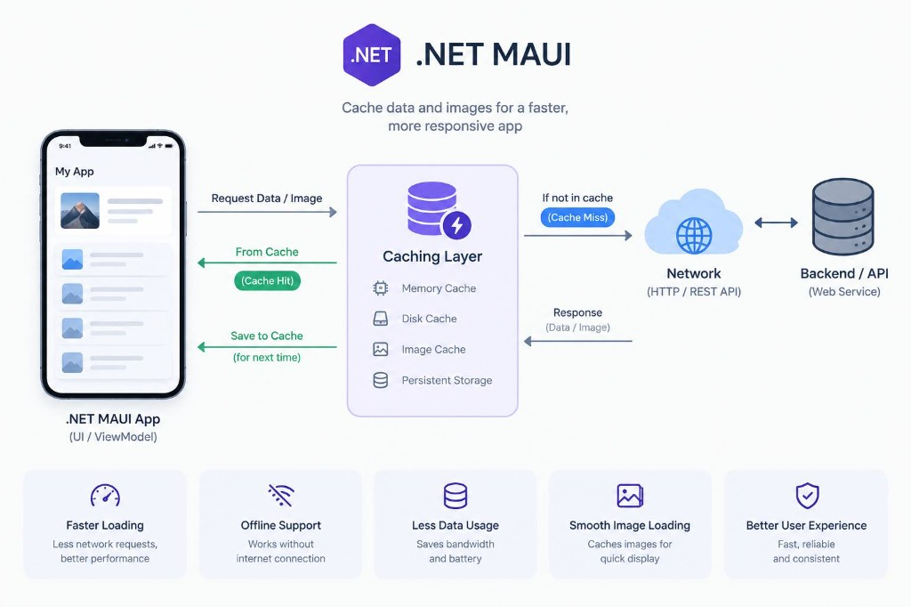

# Maui.SmartImage

<p align="center">
  
</p>

[](LICENSE)
[](https://dotnet.microsoft.com/)
[](https://learn.microsoft.com/dotnet/maui/)
[](https://www.nuget.org/packages/SmartImage.Maui)

A cache-aware, retryable image control for **.NET MAUI 10**.

`SmartImage` automatically detects whether a source is a local MAUI resource, a local file, or a remote HTTP(S) URL. Local images load through MAUI with no network. Remote images go through a two-tier memory + disk cache, with retry/backoff, request deduplication, size/timeout limits, and a Loading / Loaded / Failed UI — without blocking the UI thread.

<p align="center">
  
</p>

<p align="center"><em>Cache images for a faster, more responsive MAUI app — hit memory/disk first, then fall back to the network.</em></p>

## Why SmartImage?

| | |
|---|---|
| **Faster loading** | Fewer network round-trips; memory hits are instant. |
| **Offline-friendly** | Disk cache serves previously loaded images without connectivity. |
| **Less data usage** | Bounded downloads and cache reuse save bandwidth and battery. |
| **Smooth UX** | Skeleton shimmer, fade-in, placeholder/error images, and a tappable retry overlay. |
| **Production defaults** | Size limits, TTL, atomic disk writes, transient-only retries, and clear failure when `UseSmartImage()` is missing. |

## Requirements

- .NET 10 SDK
- .NET MAUI 10 workload

## Install

```sh
dotnet add package SmartImage.Maui
```

In `MauiProgram.cs`:

```csharp
var builder = MauiApp.CreateBuilder();
builder
    .UseMauiApp<App>()
    .UseSmartImage(); // registers IImageCache + IImageLoader
```

## Quick start

```xml
<ContentPage xmlns:controls="clr-namespace:Maui.SmartImage.Controls;assembly=Maui.SmartImage">
    <controls:SmartImage Source="logo.png" />
</ContentPage>
```

```xml
<controls:SmartImage
    Source="{Binding ImageUrl}"
    Placeholder="placeholder.png"
    ErrorImage="error.png"
    CachePolicy="MemoryAndDisk"
    CacheDuration="01:00:00"
    Timeout="00:00:10"
    MaxImageSizeBytes="10485760"
    EnableFadeAnimation="True"
    KeepPreviousImageWhileLoading="True" />
```

## How it works

```
.NET MAUI App (SmartImage)
        │  request image
        ▼
   Caching layer
   ├── Memory cache  (fast path)
   └── Disk cache    (persistent, size-budgeted)
        │
        ├─ Cache hit  ──► return bytes to UI
        │
        └─ Cache miss ──► Network (HTTP/HTTPS)
                              │
                              ▼
                         save to cache
                              │
                              ▼
                         return to UI
```

1. `SmartImage` classifies `Source` as empty, local, or remote.
2. **Local** sources bind straight to MAUI `Image` (no loader/cache).
3. **Remote** sources resolve `IImageLoader` from DI → memory → disk → download.
4. Successful downloads are validated (magic bytes), stored, and shown with optional fade-in.

`IImageLoader` and `IImageCache` are normal DI services, so apps can wrap or replace them. Remote `Source` without `UseSmartImage()` sets `State = Failed` with a clear error (and asserts in DEBUG).

## `SmartImage` reference

| Property | Type | Default | Notes |
|---|---|---|---|
| `Source` | `string?` | `null` | Local resource name, local file path, or `http(s)` URL. |
| `Placeholder` | `ImageSource?` | `null` | Shown while idle/loading (unless `KeepPreviousImageWhileLoading`) and as a failure fallback if `ErrorImage` isn't set. |
| `ErrorImage` | `ImageSource?` | `null` | Shown on failure, in place of `Placeholder`. |
| `KeepPreviousImageWhileLoading` | `bool` | `false` | Keeps the previous image visible while a new load is in flight. |
| `CachePolicy` | `ImageCachePolicy` | `MemoryAndDisk` | `None` \| `Memory` \| `Disk` \| `MemoryAndDisk`. |
| `CacheDuration` | `TimeSpan?` | `null` | Falls back to `SmartImageOptions.DefaultCacheDuration` (7 days). |
| `Timeout` | `TimeSpan?` | `null` | Falls back to `SmartImageOptions.DefaultTimeout` (15s) per attempt. |
| `MaxImageSizeBytes` | `long?` | `null` | Falls back to `SmartImageOptions.DefaultMaxImageSizeBytes` (15 MB). |
| `MaxRetryCount` | `int` | `2` | Automatic retries after the first attempt. |
| `EnableAutomaticRetry` | `bool` | `true` | Retries timeouts, network errors, and HTTP 408/429/5xx only. |
| `RetryDelay` | `TimeSpan` | `1s` | Base delay; actual delay is `RetryDelay * 2^attempt` plus jitter. |
| `EnableFadeAnimation` | `bool` | `true` | Fades when swapping to a newly loaded remote image. |
| `Aspect` | `Aspect` | `AspectFill` | Passed through to the inner `Image`. |
| `RetryButtonText` | `string` | `"Retry"` | Text of the built-in retry overlay. |
| `RetryOverlayBackgroundColor` | `Color` | `#E5E7EB` | |
| `RetryButtonTextColor` | `Color` | `#374151` | |
| `RetryButtonFontSize` | `double` | `12` | |
| `SkeletonColor` | `Color` | `#E5E7EB` | Skeleton base color while loading. |
| `SkeletonHighlightColor` | `Color` | `#F9FAFB` | Shimmer highlight color. |
| `State` (read-only) | `SmartImageState` | `Idle` | `Idle` \| `Loading` \| `Loaded` \| `Failed`. |
| `Error` (read-only) | `string?` | `null` | Set when `State == Failed`. |
| `RetryCommand` (read-only) | `ICommand` | | Wired to the built-in overlay; bind your own UI if preferred. |

## `SmartImageOptions`

Configure globally via `builder.UseSmartImage(options => { ... })`:

```csharp
builder.UseSmartImage(options =>
{
    options.DefaultTimeout = TimeSpan.FromSeconds(10);
    options.DefaultCacheDuration = TimeSpan.FromDays(3);
    options.DefaultMaxImageSizeBytes = 10 * 1024 * 1024;
    options.MemoryCacheSizeLimitBytes = 32 * 1024 * 1024;
    options.MaxDiskCacheSizeBytes = 128 * 1024 * 1024;
    options.DiskCacheDirectory = Path.Combine(FileSystem.CacheDirectory, "my_app_image_cache");
    options.PrimaryHttpMessageHandlerFactory = () => new HttpClientHandler
    {
        // Dev-only certificate trust — do not ship this in production
        ServerCertificateCustomValidationCallback = HttpClientHandler.DangerousAcceptAnyServerCertificateValidator
    };
    options.ConfigureHttpClient = client => client.DefaultRequestHeaders.Add("User-Agent", "MyApp/1.0");
});
```

Clear the cache at runtime via DI:

```csharp
var cache = handler.MauiContext.Services.GetRequiredService<IImageCache>();
await cache.ClearAsync(CancellationToken.None);
```

## Error handling

Remote loads never throw past `IImageLoader.LoadAsync` and never block the UI thread indefinitely. HTTP errors, timeouts, DNS/connection failures, SSL/TLS errors, corrupted bodies, and oversized responses map to `ImageLoadErrorKind` and set `SmartImage.State = Failed` with a retry affordance.

## Build, test, pack

```sh
dotnet test Maui.SmartImage.sln
dotnet pack Maui.SmartImage/Maui.SmartImage.csproj -c Release -o artifacts
```

See [CONTRIBUTING.md](CONTRIBUTING.md) and [CHANGELOG.md](CHANGELOG.md).

## License

MIT — see [LICENSE](LICENSE).
